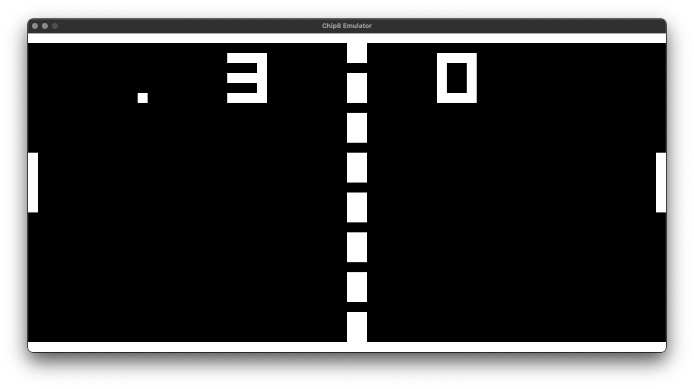

# emulator_chip8

Emulating a chip8 processor in Rust using SDL2

## Requirements

- SDL2
- SDL2_mixer

## Usage

> Please provide your own programs / roms, pong2 and tetris for example

### Building

```Rust
cargo build --release
```

### Running

```Rust
cargo run --release PATH_TO_ROM
```

## Credits

Inspired by [Laurence Muller's article](https://multigesture.net/articles/how-to-write-an-emulator-chip-8-interpreter/), How to write an emulator (CHIP-8 interpreter)

## Inplay

Pong 2

